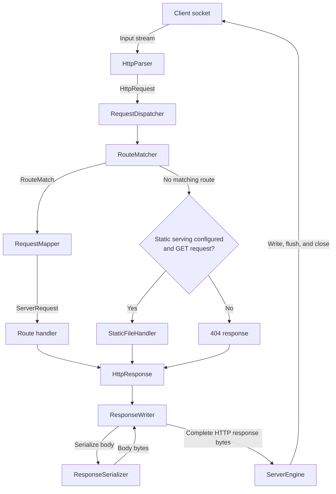

# Razor: Full-Stack Web Framework

Razor is my small, from-scratch HTTP server written in Java. I started it to better understand what frameworks abstract from the user. Things like accepting socket connections, parsing raw HTTP, matching routes, and turning Java values into HTTP responses.

It is still a work in progress, but the basic request-to-response path is up and running.

## What is implemented

- A blocking TCP server built with `ServerSocket`
- HTTP request parsing for the request line, headers, and `content-length` body
- Support for `GET`, `POST`, `PUT`, `PATCH`, and `DELETE` methods
- Method-based route registration with literal and named path segments
- Route precedence that favors the most specific literal path
- UTF-8 query-string parsing with form-style percent decoding
- Lambda-based request handlers
- HTTP/1.1 response writing with status lines, headers, and calculated content length
- JSON response serialization with Jackson
- Convenience responses for common status codes, including `200`, `201`, `204`, `400`, `401`, `403`, `404`, and `500`
- JSON request-body deserialization into registered `RequestShape` classes
- Static-file serving with path traversal protection
- Error responses for malformed requests, missing routes, unsupported media types, and handler failures
- Concurrent request handling with a bounded thread pool
- Request-body validation with `@NotNull`, `@Min`, `@Max`, and `@Size`
- Automated tests for HTTP parsing, routing, query parameters, route patterns, and static files

## Example usage

Replace the contents of `src/main/java/io/github/catcherpearce/razorserver/example/Main.java`
with this example. It demonstrates all five supported HTTP methods, named path
variables, decoded query parameters, JSON request shapes, all four validation
annotations, raw request bodies, and static-file serving. The handlers echo
request data; they do not persist users.

```java
package io.github.catcherpearce.razorserver.example;

import io.github.catcherpearce.razorserver.http.Response;
import io.github.catcherpearce.razorserver.server.RazorServer;
import io.github.catcherpearce.razorserver.validation.RequestShape;
import io.github.catcherpearce.razorserver.validation.annotations.Max;
import io.github.catcherpearce.razorserver.validation.annotations.Min;
import io.github.catcherpearce.razorserver.validation.annotations.NotNull;
import io.github.catcherpearce.razorserver.validation.annotations.Size;

import java.nio.file.Path;
import java.util.Map;

public class Main {
    public record UserBody(
            @NotNull @Size(min = 2, max = 50) String name,
            @NotNull @Min(18) @Max(120) Integer age
    ) implements RequestShape {}

    public record RenameBody(
            @NotNull @Size(min = 2, max = 50) String name
    ) implements RequestShape {}

    public static void main(String[] args) {
        int port = Integer.parseInt(System.getenv().getOrDefault("PORT", "3000"));
        RazorServer server = new RazorServer(port);
        server.staticFiles(Path.of("public"));

        // Literal routes take precedence over variable routes.
        server.get("/users/me", request -> Response.text("Current user"));

        server.get("/users/{userId}", request -> Response.ok(Map.of(
                "userId", request.pathVariables().get("userId"),
                "greeting", request.queryParams().getOrDefault("greeting", "Hello")
        )));

        // The mapper deserializes and validates JSON before invoking the handler.
        server.post("/users", request -> {
            UserBody body = request.bodyAs(UserBody.class);
            return Response.created(body);
        }, UserBody.class);

        server.put("/users/{userId}", request -> {
            UserBody body = request.bodyAs(UserBody.class);
            return Response.ok(Map.of(
                    "userId", request.pathVariables().get("userId"),
                    "replacement", body
            ));
        }, UserBody.class);

        server.patch("/users/{userId}", request -> {
            RenameBody body = request.bodyAs(RenameBody.class);
            return Response.ok(Map.of(
                    "userId", request.pathVariables().get("userId"),
                    "name", body.name()
            ));
        }, RenameBody.class);

        server.delete("/users/{userId}", request -> Response.noContent());

        // Without a request shape, the body remains a raw string.
        server.post("/echo", request -> Response.text((String) request.body()));

        // GET / falls back to public/index.html because no route matches it.
        server.start();
    }
}
```

Create static files from the project root before starting the application:

```bash
mkdir -p public
printf '%s\n' '<!doctype html><html><body><h1>Hello from Razor</h1></body></html>' > public/index.html
printf '%s\n' 'Hello from a static file' > public/hello.txt
```

Run `io.github.catcherpearce.razorserver.example.Main` from your IDE with the project root as
its working directory. In another terminal, try each method (adjust the port if
you set `PORT`):

```bash
# GET: named path variable and a percent-decoded query parameter
curl -i 'http://localhost:3000/users/42?greeting=Hello%20Ada'

# GET: literal route takes precedence over /users/{userId}
curl -i http://localhost:3000/users/me

# POST: deserialize and validate a JSON body; returns 201
curl -i -X POST http://localhost:3000/users \
  -H 'Content-Type: application/json' \
  -d '{"name":"Ada Lovelace","age":36}'

# PUT: replacement body and path variable
curl -i -X PUT http://localhost:3000/users/42 \
  -H 'Content-Type: application/json' \
  -d '{"name":"Grace Hopper","age":85}'

# PATCH: update just the name
curl -i -X PATCH http://localhost:3000/users/42 \
  -H 'Content-Type: application/json' \
  -d '{"name":"Ada Byron"}'

# DELETE: returns 204 with no response body
curl -i -X DELETE http://localhost:3000/users/42

# Raw text body
curl -i http://localhost:3000/echo \
  -H 'Content-Type: text/plain' -d 'Hello Razor'

# Unmatched GET requests serve files from public/
curl -i http://localhost:3000/
curl -i http://localhost:3000/hello.txt

# Invalid request shape: returns 400 before the handler runs
curl -i -X POST http://localhost:3000/users \
  -H 'Content-Type: application/json' \
  -d '{"name":"A","age":17}'
```

The first request returns JSON such as:

```json
{"userId":"42","greeting":"Hello Ada"}
```

Registered routes take priority over static files. Static fallback applies only
to unmatched `GET` requests; a missing file returns `404`.

Use `Response.json(body)` or `Response.text(body)` for a `200` response with an
explicit representation. Both also accept a status code as their first argument,
such as `Response.text(201, "Created")`. `Response.ok(body)` remains available as
a `200` JSON convenience, alongside `created`, `noContent`, `badRequest`,
`unauthorized`, `forbidden`, `notFound`, `internalServerError`, and `status`. A
handler can also return an `HttpResponse` directly when it needs to control the
status, headers, and body.

## Request flow



## Socket reading

[ServerEngine](src/main/java/io/github/catcherpearce/razorserver/server/ServerEngine.java)
opens a `ServerSocket` and blocks in `accept()` until a client connects. Each
accepted socket is submitted to a thread pool with 5 core workers, a maximum of
10 workers, and a queue of 100 tasks. When the pool and queue are full, the
accepting thread handles the connection itself, slowing further accepts.

The worker gives the socket's input stream to a fresh `HttpParser`. Reads are
blocking: the parser waits for the request headers and any declared body bytes.
Each connection handles one request and one response, then closes through
try-with-resources. Persistent connections and request pipelining are not
implemented.

## HTTP parsing

[HttpParser](src/main/java/io/github/catcherpearce/razorserver/http/HttpParser.java) reads
bytes until `\r\n\r\n` marks the end of the headers. It splits the request line
into a method, request target, and HTTP version, requiring `HTTP/1.1`. The request
target still includes its query string at this stage.

Header names are lowercased, surrounding whitespace is trimmed, and duplicate
headers are rejected. If `Content-Length` is present, the parser reads exactly
that many body bytes and decodes them as UTF-8. Without it, the parsed body is
empty; chunked request-body decoding is not implemented.

The parser enforces an 8 KiB request-line limit, a 32 KiB header limit, and a
1 MiB body limit. Malformed request lines, invalid lengths, and premature end of
stream produce a malformed-request exception. The resulting `HttpRequest`
contains the method, target, version, headers, and raw string body.

## Route creation

Calls such as `server.get("/users/{id}", handler)` register routes through
[RequestDispatcher](src/main/java/io/github/catcherpearce/razorserver/server/RequestDispatcher.java).
[RoutePattern](src/main/java/io/github/catcherpearce/razorserver/server/RoutePattern.java)
validates the pattern, separates its segments, and replaces named variables
with `{}` while retaining their names in order:

```text
/users/{id}/posts/{postId}
    segments: [users, {}, posts, {}]
    names:    [id, postId]
```

Patterns must begin with `/`. Empty segments, trailing slashes other than `/`,
malformed variable names, and repeated variable names are rejected. A variable
can be the first segment, as in `/{tenant}/users`. The root pattern `/` has no
segments.

Registration walks a tree of `RouteNode` objects. Each node has literal children,
one optional variable child, and a map from HTTP methods to routes. Common
prefixes share nodes. The final node stores the handler, optional request-body
shape, and variable names. Registering the same normalized path and method twice
raises a duplicate-route exception; different methods can share an endpoint.

## Route matching

A new [RouteMatcher](src/main/java/io/github/catcherpearce/razorserver/server/RouteMatcher.java)
is created for each request. It holds the request's path segments, method,
query parameters, and captured variables while searching the shared route tree.

Matching uses depth-first search with backtracking. At each segment it tries the
literal child first, then the variable child if the literal search fails. A
match succeeds only after every segment is consumed and the endpoint has a
handler for the requested method. This gives earlier literal segments priority,
without scanning every registered route or separately ranking candidates.

For example, `/users/me` takes priority over `/users/{id}` when both support
`GET`. If only the variable route supports `GET`, matching falls back to it.
Captured values are added when entering variable branches and removed when those
branches fail, so only values from the successful path remain.

A failed search currently throws `RouteNotFoundException`, including when the
path exists only for another method. The dispatcher can fall back to static-file
serving for unmatched `GET` requests when configured; otherwise the request gets
a `404`. A registered `GET /` takes priority over the static `index.html` fallback.

## Path and query parsing

The matcher separates the request target at the first literal `?`. It removes
the path's leading slash and splits the remaining path into segments; `/` becomes
an empty array and is matched directly on the root node. Literal matching is
case-sensitive. Path segments are not percent-decoded, and empty segments are
preserved, so a variable branch can currently capture an empty string.

For `/users/42?expanded=true` matched against `/users/{id}`, the dispatcher pairs
the captured value `42` with the registered name `id`. The handler receives
`request.pathVariables().get("id")` and
`request.queryParams().get("expanded")`. `RouteMatch.route()` contains the actual
path without the query string; `ServerRequest.path()` retains the original target.

### Query parameters

Everything after the first literal `?` is parsed as the query string and does
not participate in route matching. Keys and values are UTF-8 percent-decoded,
and `+` is treated as a space. For example:

```text
/search?q=java+server&expression=a%26b%3Dc
```

produces:

```java
Map.of(
        "q", "java server",
        "expression", "a&b=c"
)
```

A parameter without a value (`?debug`) and an explicitly empty value
(`?debug=`) both produce an empty string. Empty keys, empty parameter entries,
duplicate keys, invalid percent encoding, queries over 8,192 characters, and
queries with more than 100 parameters are rejected with `400 Bad Request`.

## Request mapping and handlers

[RequestMapper](src/main/java/io/github/catcherpearce/razorserver/server/RequestMapper.java)
combines the parsed request with named path variables and query parameters into
`ServerRequest`. If a route declares a `RequestShape`, its JSON body is
deserialized and validated before the handler runs. Otherwise the body remains
a raw string. Handlers return an `HttpResponse`, often through the `Response`
convenience methods shown above.

## Writing back to the socket

[ResponseWriter](src/main/java/io/github/catcherpearce/razorserver/http/ResponseWriter.java)
turns an `HttpResponse` into a complete HTTP/1.1 byte array. First,
`ResponseSerializer` encodes JSON bodies with Jackson, text bodies as UTF-8, and
passes raw byte arrays through directly. A `204` response always has an empty
body and skips serialization.

The writer builds the status line and headers using CRLF line endings, replaces
any supplied `Content-Length` with the actual serialized byte count, adds the
blank line separating headers from the body, and appends the body bytes. Using
byte length rather than character count keeps lengths correct for UTF-8 text.

`ServerEngine` writes those bytes to the client socket's output stream, flushes
it, and closes the connection. HTTP exceptions raised while parsing or handling
the request are converted to error responses; unexpected runtime exceptions in
that stage produce a `500` response.

## Running locally

You will need Java 25 and Maven.

Compile the project with:

```bash
mvn compile
```

Run the automated tests with:

```bash
mvn test
```

Then run `io.github.catcherpearce.razorserver.example.Main` from your IDE. The server will keep listening on the configured port until the process is stopped.

## Project layout

```text
src/main/java/io/github/catcherpearce/razorserver/
├── example/      # Example application
├── exception/    # HTTP and route-registration exceptions
├── file_serving/ # Static-file responses
├── http/         # HTTP models, parsing, serialization, and response helpers
├── server/       # Socket engine, routing, dispatch, and handlers
└── validation/   # Request shapes, deserialization, and validation annotations
```

## Still in progress

This is intentionally a learning project rather than a production-ready server. The next pieces still need to be connected or expanded:

- Persistent HTTP connections and request pipelining
- Broader HTTP protocol compliance, including chunked request bodies
- Distinguishing unsupported route methods (`405`) from missing paths (`404`)
- Removing query strings before static-file lookup
- More response content types and richer header handling
- More integration tests and example routes
